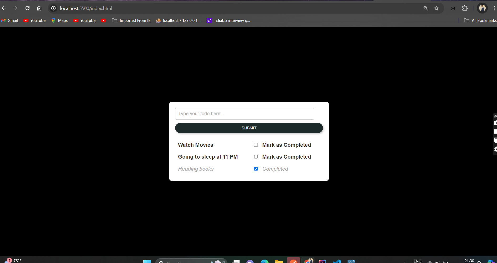

## GrowSpace ToDo Application
This project is a simple ToDo application with a Java backend built using Spring Boot, and a frontend developed using HTML, CSS, and JavaScript. The backend provides RESTful APIs for managing ToDo items, while the frontend offers a user-friendly interface for interacting with the ToDo list.



## Features
- **Create a ToDo:** Users can create a new ToDo item by entering a task and submitting it.
- **List ToDos:** The application lists all ToDo items in descending order of their creation date, along with their status.
- **Update ToDo Status:** Users can mark a ToDo item as completed or incomplete by updating its status.

## Project Structure
### Backend
- **Framework:** Spring Boot
- **Language:** Java
- **Development Environment:** IntelliJ IDEA
- **Controller Class:**
  - The `ToDoController` class handles API requests for creating, retrieving, and updating ToDo items.
  - The endpoints are as follows:
    - `POST /todos/create`: Create a new ToDo item.
    - `GET /todos/get`: Retrieve all ToDo items.
    - `PUT /todos/update/{id}`: Update the status of a ToDo item.
    - `GET /todos/say`: Custom endpoint to return ToDos in a specific format.

### Frontend
- **Languages:** HTML, CSS, JavaScript
- **Development Environment:** Visual Studio Code (VS Code)
- **UI Design:**
  - The frontend is designed to be simple and intuitive, allowing users to easily add tasks and manage their ToDo list.
  - Users can see the tasks listed with options to mark them as completed.

## Installation and Setup
### Backend Setup
1. **Clone the Repository:**
   ```bash
   git clone https://github.com/nachii123/grow_assignment.git
   
## Navigate to the Project Directory:
**cd GrowSpace**

## Build and Run the Backend:
-Ensure you have Java and Maven installed on your system.
-Build the project using Maven:
-mvn clean install

## Run the Spring Boot application:
-mvn spring-boot:run
-Frontend Setup

## Navigate to the Frontend Directory:
-Open the frontend files in Visual Studio Code (VS Code).
-Open the index.html File:
-Open the index.html file directly in your browser to start using the frontend.

## Usage
## Add a ToDo:
-Enter the task in the input field and click the "Submit" button.
## View ToDos:
--The tasks will be listed below the input field in descending order of creation.
--Mark as Complete:
--Click the checkbox next to a task to mark it as completed.

## API Endpoints
## Create a ToDo:
--POST /todos/create
Request Body: JSON object with the task details.

## List All ToDos:
--GET /todos/get
Response: JSON array of all ToDo items.

## Update ToDo Status:
--PUT /todos/change/{id}
Request Parameter: status (Boolean)

## Response: Updated ToDo item.
Custom Endpoint:
--GET /todos/say
Returns all ToDos in a specific format.

## Technologies Used

## Backend:
**Java**
**Spring Boot**

## Frontend:
**HTML**
**CSS**
**JavaScript**

## Database:
**MySQL**

## Development Tools:
**IntelliJ IDEA (Backend)**
**Visual Studio Code (Frontend)**

## Contributing
--Contributions are welcome! Feel free to submit a pull request or open an issue for any bugs or improvements.
